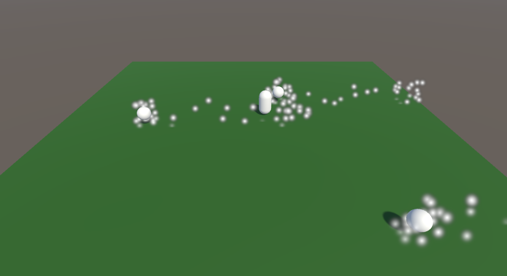
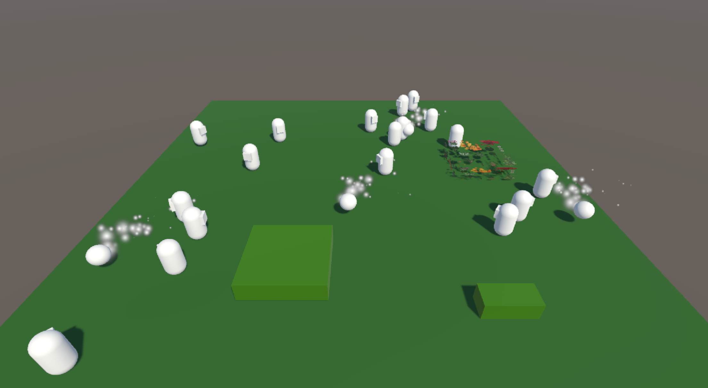
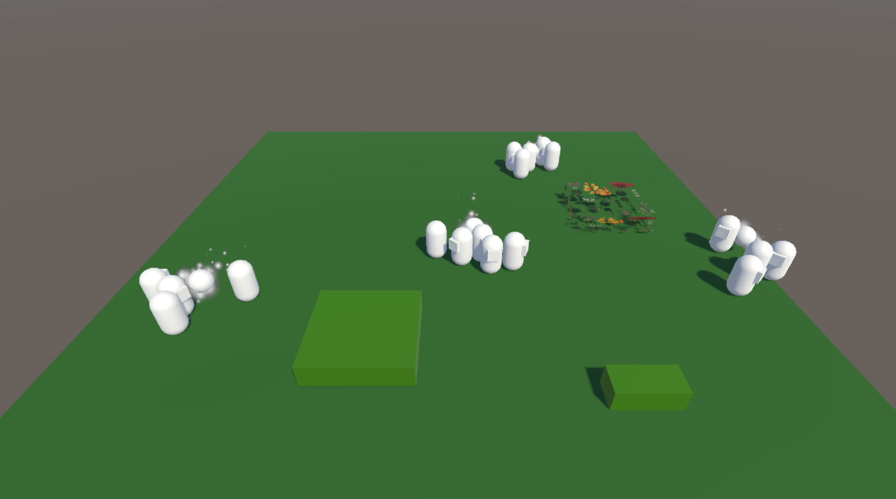
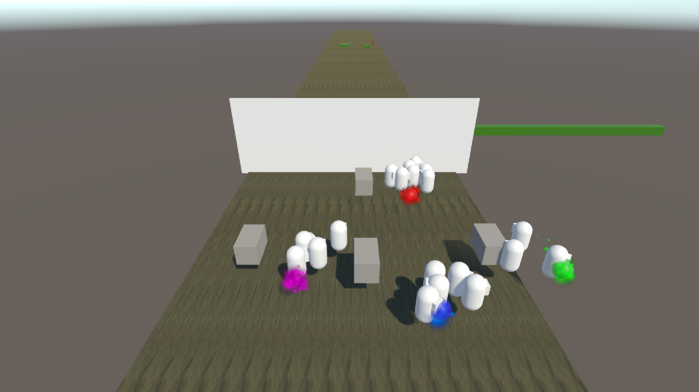
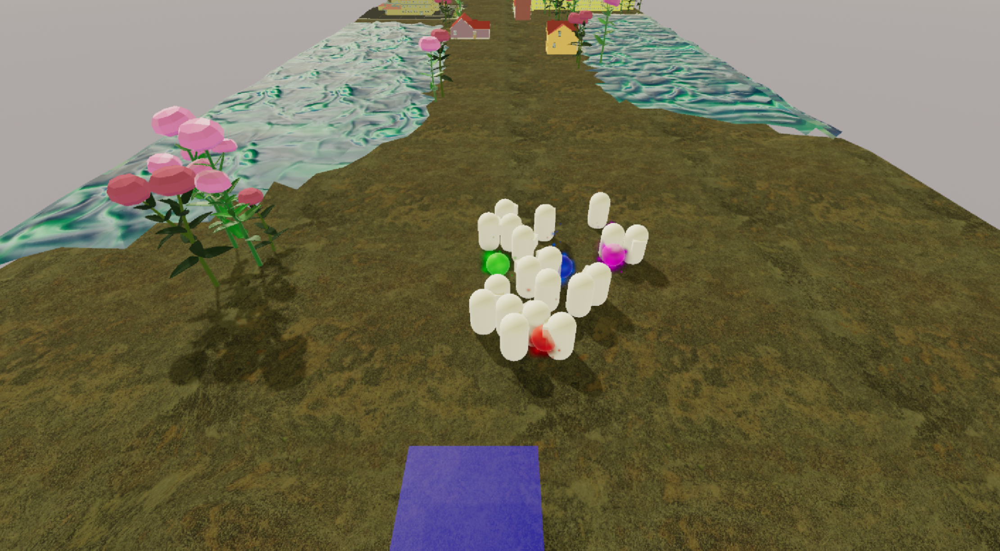
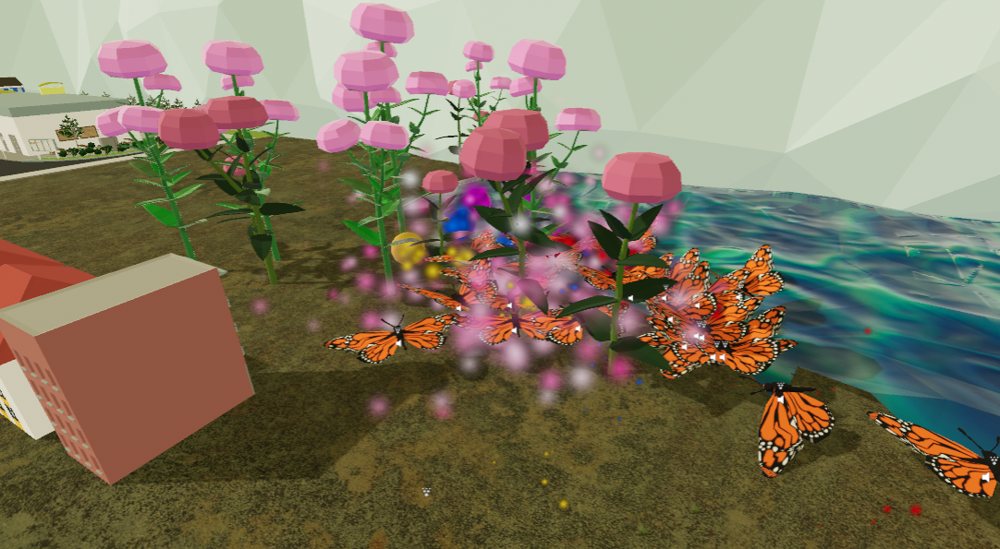
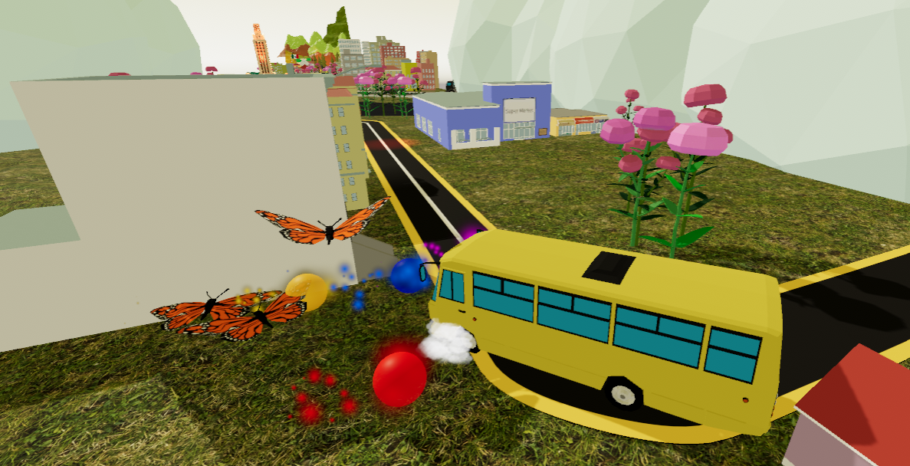

# Social Butterfly Experience Scripts
Documentation of the scripts I was responsible for in a group project.  

Visit the full [Project Website](https://socialbutterflyyy.wixsite.com/socialbutterfly/) for more details about the project itself.

- [My Role](https://github.com/VeyGudTek/Social_Butterfly_Experience_Scripts/tree/main?tab=readme-ov-file#my-role)
- [Scripts and Functions](https://github.com/VeyGudTek/Social_Butterfly_Experience_Scripts/tree/main?tab=readme-ov-file#scripts-and-functions)
- [Development Process](https://github.com/VeyGudTek/Social_Butterfly_Experience_Scripts/tree/main?tab=readme-ov-file#development-process)

## My Role
&emsp;My role in this project was the lead gameplay engineer. I was responsible for implementing the core gameplay mechanics into Unity. Additionally, I assisted in implementing assets and feedback into the game in the later stages of development.

## Scripts and Functions
### Player
Object controlled by players. Tracks previous position using a queue of TrailPoints.

__Functions__

- update_trail()
  - Updates queue with new TrailPoint
  - Updates particle system

- check_moving()
  - Checks whether the player is moving, based on distance traveled

- realtime_movement()
  - Moves object based on an input object. Input object contains realtime data from a motion caption system.

- manual_movement()
  - Moves object using WASD controls. Used for debugging, when the motion capture system is not available.
  
### Butterfly
Butterfly gameObject that follows the player and interacts with the environment. Each has an independent speed and destination.

__Functions__

- move()
  - Add force on rigidbody towards destination

- rotate()
  - Rotates rigidbody towards destination
 
- constrain_to_360()
  - Convert any angle to its equivalent from 0 to 360
  - Used by rotate() to normalize angles
 
- constrain_to_180()
  - Convert any angle from 0 to 360 to -180 to 180
  - Used by rotate() to get shortest rotation to destination
 
- set_destination()
  - Set the destination of the butterfly using consolidated TrailPoints, acquired using get_trail_points() from Manager
  - Filters consolidated list based on ID

- set_flap_speed()
  - Changes animation speed based on actual speed of player

### Manager
Object that keeps track of all players and butterflies, providing a connection between them. Also manages gamestate.

__Functions__

- spawn_butterflies()
  - spawns player specific butterflies and communal butterflies using the spawn_butterflies_helper function

- spawn_butterflies_helper()
  - Instantiates butterfly gameObject at a random position
  - Assigns ID to butterfly, corresponding to a player

- start_game()
  - Checks for game start condition

- start_game_assets()
  - Sets in-game assets after the game has started

- get_trail_points()
  - Consolidate TrailPoints of active players. Returns a list of TrailPoints

- delete_butterfly()
  - Called by Butterflies when they die
  - Removes Butterfly from list, deletes butterfly, and calls redistribute_ids()

- redistribute_ids()
  - Redistribute the ID's of the butterflies so that there is a more even spread among players

- Class Butterfly_ID_List
  - A class containing a list of butterflies, filtered by ID, and the corresponding ID
  - Used by redistribute_ids()

- update_progress_bar()
  - Updates in-game progress bar, based on time

- check_game_over()
  - Check for game over conditions
  - Sets in-game assets

- decide_end_map()
  - Set in-game assets after the game has ended, based on time

- send_osc()
  - send OSC message using the OSC JACK plugin
  - has overloads for float, string, and int

### StartBox
Changes color if corresponding player is in contact.

### TrailPoint
Class containing a Vector3, representing position, and an ID, representing the player.

## Development Process
&emsp;The development of the gameplay mechanics takes place in its own development scene. This was done mainly so that I could make any changes I want to the scene in order to test the code without having to worry about merge conflicts. Additionally, the development scene will not be cluttered with final assets and level design, making it easier to navigate the scene and test the code. Other members are able to build out the level at the same time as I develop the code without fear of interference. I first implemented the barebones mechanics of the game, which involves creating a system where gameObjects will follow other gameObjects.

  

&emsp;After implementing the base gameplay mechanic, I began building in the rest of the core mechanics. This includes collision box interactions, updating and improving the movement system, defining the distribution of butterflies, etc.

   
  

  

&emsp;After refining the existing base mechanics, they needed to be implemented into the actual level. At this point, the game needed to be a playable prototype, so a start, an end, and movement through the level were added.

   
  

  

&emsp;Now, the only thing left to do is to refine the game. This mostly comes in the form of implementing assets, such as animations and cutscenes, tuning the numbers, and fixing any potential bugs.

   
  

  

